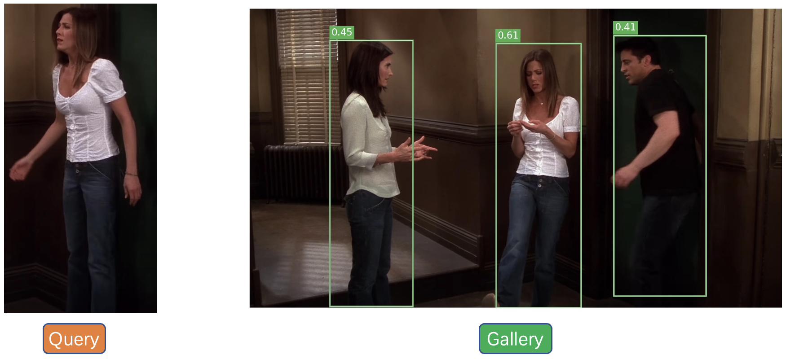

This repository hosts the source code of our paper: [[WACV 2023] SAT: Scale-Augmented Transformer for Person Search](https://openaccess.thecvf.com/content/WACV2023/html/Fiaz_SAT_Scale-Augmented_Transformer_for_Person_Search_WACV_2023_paper.html). 


## Abstract

Person search is a challenging computer vision problem where the objective is to simultaneously detect and reidentify a target person from the gallery of whole scene images captured from multiple cameras. Here, the challenges related to underlying detection and re-identification tasks need to be addressed along with joint optimization of these two tasks. In this paper, we propose a three-stage cascaded Scale-Augmented Transformer (SAT) person search framework. In the three-stage design of our SAT framework, the first stage performs person detection whereas the last two stages perform both detection and re-identification.
Considering the contradictory nature of detection and reidentification, in the last two stages, we introduce separate norm feature embeddings for the two tasks to reconcile the relationship between them in a joint person search model. Our SAT framework benefits from the attributes of convolutional neural networks and transformers by introducing a convolutional encoder and a scale modulator within each stage. Here, the convolutional encoder increases the generalization ability of the model whereas the scale modulator performs context aggregation at different granularity levels to aid in handling pose/scale variations within a region of interest. To further improve the performance during occlusion, we apply shifting augmentation operations at each granularity level within the scale modulator. Experimental results on challenging CUHK-SYSU [35] and PRW
[47] datasets demonstrate the favorable performance of our method compared to state-of-the-art methods.


Performance profile:

| Dataset   | mAP  | Top-1 | Model                                                        |
| --------- | ---- | ----- | ------------------------------------------------------------ |
| CUHK-SYSU | 94.4 | 94.8  | [model](https://drive.google.com/file/d/13Z49YUoUYVTYj0TMIdxvMbucg8wIF8Ar/view?usp=sharing) |
| PRW       | 54.5 | 87.5  | [model](https://drive.google.com/file/d/1tzRrEI-axu6gq5w_mEcqWAoRTSVM8ANB/view?usp=sharing) |


## Installation

Create the environment using yml  `conda env create -f satnet.yml` in the root directory of the project.


## Quick Start

Let's say `$ROOT` is the root directory.

1. Download [CUHK-SYSU](https://drive.google.com/open?id=1z3LsFrJTUeEX3-XjSEJMOBrslxD2T5af) and [PRW](http://pan.baidu.com/s/1i5tqYbj) datasets, and unzip them to `$ROOT/data`
```
$ROOT/data
├── CUHK-SYSU
└── PRW
```
2. Following the link in the above table, download our pre-trained model to anywhere you like, e.g., `$ROOT/exp_cuhk`
3. Run an inference demo by specifying the paths of the checkpoint and corresponding configuration file. `python train.py --cfg $ROOT/exp_cuhk/config.yaml --ckpt $ROOT/exp_cuhk/best_cuhk.ph` You can checkout the result in `demo_imgs` directory.



## Training

Pick one configuration file you like in `$ROOT/configs`, and run with it.

```
python train.py --cfg configs/cuhk_sysu.yaml
```

**Note**: At present, our script only supports single GPU training, but distributed training will be also supported in future. By default, the batch size and the learning rate during training are set to 3 and 0.003 respectively. If your GPU cannot provide the required memory, try smaller batch size and learning rate (*performance may degrade*). Specifically, your setting should follow the [*Linear Scaling Rule*](https://arxiv.org/abs/1706.02677): When the minibatch size is multiplied by k, multiply the learning rate by k. For example:

```
python train.py --cfg configs/cuhk_sysu.yaml INPUT.BATCH_SIZE_TRAIN 3 SOLVER.BASE_LR 0.0003
```

**Tip**: If the training process stops unexpectedly, you can resume from the specified checkpoint.

```
python train.py --cfg configs/cuhk_sysu.yaml --resume --ckpt /path/to/your/checkpoint
```

## Test

Suppose the output directory is `$ROOT/exp_cuhk`. Test the trained model:

```
python train.py --cfg $ROOT/exp_cuhk/config.yaml --eval --ckpt $ROOT/exp_cuhk/epoch_xx.pth 
```

Test the upper bound of the person search performance by using GT boxes:

```
python train.py --cfg $ROOT/exp_cuhk/config.yaml --eval --ckpt $ROOT/exp_cuhk/epoch_xx.pth EVAL_USE_GT True
```

## Contact
If you have any questions, please create an issue on this repository or contact us at mustansar.fiaz@mbzuai.ac.ae

<hr />

## References
Our code is based on [SeqNet](https://github.com/serend1p1ty/SeqNet) and [COAT](https://github.com/Kitware/COAT)  repositories. 
We thank them for releasing their baseline code.

**SAT**: "SAT: Scale-Augmented Transformer for Person Search", WACV, 2022 (*MBZUAI*). [[Paper](https://openaccess.thecvf.com/content/WACV2023/papers/Fiaz_SAT_Scale-Augmented_Transformer_for_Person_Search_WACV_2023_paper.pdf)][[PyTorch](https://github.com/mustansarfiaz/SAT)]


## Citation

```
@inproceedings{fiaz2023sat,
  title={SAT: Scale-Augmented Transformer for Person Search},
  author={Fiaz, Mustansar and Cholakkal, Hisham and Anwar, Rao Muhammad and Khan, Fahad Shahbaz},
  booktitle={Proceedings of the IEEE/CVF Winter Conference on Applications of Computer Vision},
  year={2023}
}
@inproceedings{fiaz2022psarm,
  title={PS-ARM: An End-to-End Attention-aware Relation Mixer Network for Person Search},
  author={Fiaz, Mustansar and Cholakkal, Hisham and Narayan, Sanath and Anwar, Rao Muhammad and Khan, Fahad Shahbaz},
  booktitle={Proceedings of the ACCV Asian Conference on Computer Vision}, 
  year={2022}
}
